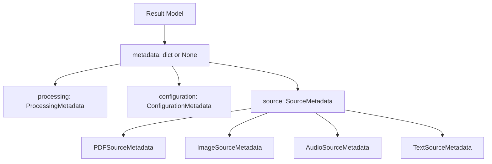

# Data Model: Metadata Dictionary for Result Models

**Feature**: 015-extend-all-result
**Date**: 2025-10-25
**Status**: Design Complete

---

## Overview

This document defines the data models and metadata schema for extending all result models with optional metadata dictionaries. The metadata preserves source document information and processing context across all modules (PDF, image, audio, text).

---

## Core Entities

### 1. ProcessingMetadata

**Description**: Universal metadata fields common to all processing modules

**Attributes**:
- `timestamp`: ISO 8601 timestamp with timezone (e.g., "2025-10-25T14:30:00+00:00")
- `model_version`: String identifier of the processing model/version used
- `processing_time_seconds`: Float representing total processing duration

**Validation Rules**:
- `timestamp` must be valid ISO 8601 format with timezone
- `model_version` must be non-empty string
- `processing_time_seconds` must be >= 0.0

**Example**:
```python
{
    "timestamp": "2025-10-25T14:30:00+00:00",
    "model_version": "mlx-community/gemma-3-4b",
    "processing_time_seconds": 2.45
}
```

---

### 2. ConfigurationMetadata

**Description**: Configuration parameters used during processing

**Attributes**:
- `user_provided`: Dict of parameters explicitly set by user
- `effective`: Dict of complete configuration after applying defaults

**Validation Rules**:
- `user_provided` keys must be subset of `effective` keys
- `effective` must contain all configuration parameters
- Both must be valid JSON-serializable dicts

**Example**:
```python
{
    "user_provided": {
        "model": "medium",
        "style": "detailed"
    },
    "effective": {
        "model": "medium",
        "style": "detailed",
        "timeout_seconds": 60,
        "batch_size": 4
    }
}
```

**Configuration Parameters Scope**:

Include in configuration metadata:
- Model settings: `model`, `model_version`, `quantization`, `provider`
- Processing parameters: `style`, `language`, `timeout_seconds`, `batch_size`, `max_duration_seconds`, `max_description_length`
- Format settings (when affecting processing): `format` (if used during processing)

Exclude from configuration metadata:
- I/O paths: input file paths, output destination paths
- Display flags: `--verbose`, `--progress`, `--no-color`
- Operational state: memory usage, CPU utilization, thread count
- Derived values: calculated fields not set by user or defaults

---

### 3. SourceMetadata (Base)

**Description**: Base structure for type-specific source metadata

**Common Attributes** (all types):
- `file_path`: String path to source file
- `file_size_bytes`: Integer file size or "unavailable"

**Validation Rules**:
- `file_path` must be non-empty string for file-based processing
- `file_size_bytes` must be positive integer or "unavailable" string
- For stdin/piped input: set to "unavailable"

---

### 4. PDFSourceMetadata (extends SourceMetadata)

**Description**: PDF-specific source metadata

**Additional Attributes**:
- `page_count`: Integer number of pages in PDF
- `creation_date`: ISO 8601 timestamp or "unavailable"
- `modification_date`: ISO 8601 timestamp or "unavailable" (optional)
- `author`: String or "unavailable" (optional)
- `title`: String or "unavailable" (optional)

**Validation Rules**:
- `page_count` must be positive integer (always available from pdfplumber)
- `creation_date` must be ISO 8601 format or "unavailable"
- Optional fields from PDF info dict; set to "unavailable" if missing

**Example**:
```python
{
    "file_path": "/path/to/document.pdf",
    "file_size_bytes": 1234567,
    "page_count": 42,
    "creation_date": "2025-01-15T09:30:00+00:00",
    "modification_date": "2025-02-20T14:45:00+00:00",
    "author": "unavailable",
    "title": "Sample Document"
}
```

---

### 5. ImageSourceMetadata (extends SourceMetadata)

**Description**: Image-specific source metadata with EXIF data

**Additional Attributes**:
- `dimensions`: Dict with `width` and `height` (pixels)
- `format`: String image format (e.g., "JPEG", "PNG")
- `exif`: Dict of all available EXIF tags (can be empty)
- `camera_info`: Dict with camera-specific fields (extracted from EXIF)

**Validation Rules**:
- `dimensions.width` and `dimensions.height` must be positive integers
- `format` must be non-empty string
- `exif` dict uses human-readable tag names (from PIL.ExifTags.TAGS)
- `camera_info` extracted from EXIF or empty dict if unavailable

**Example**:
```python
{
    "file_path": "/path/to/image.jpg",
    "file_size_bytes": 2048576,
    "dimensions": {
        "width": 1920,
        "height": 1080
    },
    "format": "JPEG",
    "exif": {
        "Make": "Canon",
        "Model": "EOS 5D Mark IV",
        "DateTime": "2025:10:25 14:30:00",
        "FNumber": 2.8,
        "ExposureTime": 0.001,
        "ISOSpeedRatings": 400,
        "FocalLength": 50.0,
        "GPSLatitude": 37.7749,
        "GPSLongitude": -122.4194
    },
    "camera_info": {
        "make": "Canon",
        "model": "EOS 5D Mark IV",
        "lens": "EF 50mm f/1.8"
    }
}
```

---

### 6. AudioSourceMetadata (extends SourceMetadata)

**Description**: Audio-specific source metadata

**Additional Attributes**:
- `duration_seconds`: Float duration in seconds
- `sample_rate_hz`: Integer sample rate
- `channels`: Integer channel count (1=mono, 2=stereo)
- `format`: String audio format (e.g., "mp3", "wav", "m4a")
- `detected_language`: ISO 639-1 language code or "unavailable"
- `language_confidence`: Float confidence score (0.0-1.0) or "unavailable"

**Validation Rules**:
- `duration_seconds` must be positive float
- `sample_rate_hz` must be positive integer
- `channels` must be 1 or 2
- `format` must be one of: "mp3", "wav", "m4a"
- `language_confidence` must be 0.0-1.0 or "unavailable"

**Example**:
```python
{
    "file_path": "/path/to/audio.mp3",
    "file_size_bytes": 5242880,
    "duration_seconds": 180.5,
    "sample_rate_hz": 44100,
    "channels": 2,
    "format": "mp3",
    "detected_language": "en",
    "language_confidence": 0.95
}
```

---

### 7. TextSourceMetadata (extends SourceMetadata)

**Description**: Text processing source metadata

**Additional Attributes**:
- `input_length_words`: Integer word count of input text
- `input_length_chars`: Integer character count
- `detected_language`: ISO 639-1 code or "unavailable"
- `chunked`: Boolean indicating if text was chunked
- `chunk_count`: Integer number of chunks or None

**Validation Rules**:
- `input_length_words` must be positive integer
- `input_length_chars` must be positive integer
- `chunked` must be boolean
- If `chunked=True`, `chunk_count` must be positive integer

**Example**:
```python
{
    "file_path": "/path/to/document.txt",
    "file_size_bytes": 102400,
    "input_length_words": 5000,
    "input_length_chars": 30000,
    "detected_language": "en",
    "chunked": true,
    "chunk_count": 5
}
```

---

## Complete Metadata Schema

### Universal Metadata Structure

All result models include this structure when `--include-metadata` is enabled:

```python
metadata: dict | None = {
    "processing": ProcessingMetadata,
    "configuration": ConfigurationMetadata,
    "source": SourceMetadata  # Type-specific: PDF, Image, Audio, or Text
}
```

**When metadata is disabled**: `metadata = None` (default)

---

## Model Extensions

### 1. ExtractionResult (PDF)

**Current Model**:
```python
@dataclass
class ExtractionResult:
    success: bool
    pages: list[PageResult]
    total_pages: int
    total_chars: int
    processing_time: float
    error_message: str | None = None
```

**Extended Model**:
```python
@dataclass
class ExtractionResult:
    success: bool
    pages: list[PageResult]
    total_pages: int
    total_chars: int
    processing_time: float
    error_message: str | None = None
    metadata: dict | None = None  # NEW: Optional metadata dictionary
```

---

### 2. DescriptionResult (Image - Single)

**Current Model**:
```python
@dataclass
class DescriptionResult:
    image_path: str
    description: str
    confidence_score: float | None
    processing_time: float
    model_used: str
    prompt_used: str
    success: bool
    technical_metadata: dict[str, Any] | None = None
    vlm_processing_time: float | None = None
    model_version: str | None = None
```

**Extended Model**:
```python
@dataclass
class DescriptionResult:
    image_path: str
    description: str
    confidence_score: float | None
    processing_time: float
    model_used: str
    prompt_used: str
    success: bool
    technical_metadata: dict[str, Any] | None = None
    vlm_processing_time: float | None = None
    model_version: str | None = None
    metadata: dict | None = None  # NEW: Optional metadata dictionary
```

---

### 3. ProcessingResult (Image - Batch)

**Current Model**:
```python
@dataclass
class ProcessingResult:
    success: bool
    results: list[DescriptionResult]
    total_images: int
    successful_count: int
    failed_count: int
    total_processing_time: float
    error_message: str | None = None
```

**Extended Model**:
```python
@dataclass
class ProcessingResult:
    success: bool
    results: list[DescriptionResult]  # Each result has its own metadata
    total_images: int
    successful_count: int
    failed_count: int
    total_processing_time: float
    error_message: str | None = None
    # Note: Metadata is per-image in results list, not at batch level
```

---

### 4. TranscriptionResult (Audio)

**Current Model**:
```python
@dataclass
class TranscriptionResult:
    audio_path: str
    text: str
    confidence_score: float | None
    processing_time: float
    model_used: str
    quantization: str
    detected_language: str | None
    success: bool
    error_message: str | None
    segments: list[TranscriptionSegment] | None = None
```

**Extended Model**:
```python
@dataclass
class TranscriptionResult:
    audio_path: str
    text: str
    confidence_score: float | None
    processing_time: float
    model_used: str
    quantization: str
    detected_language: str | None
    success: bool
    error_message: str | None
    segments: list[TranscriptionSegment] | None = None
    metadata: dict | None = None  # NEW: Optional metadata dictionary
```

---

### 5. SummaryResult (Text)

**Current Model** (Pydantic):
```python
class SummaryResult(BaseModel):
    summary: str
    tags: list[str]
    metadata: SummaryMetadata | None = None
```

**Note**: text_summarizer already has `metadata` field (SummaryMetadata with processing info). Need to extend SummaryMetadata to include universal metadata structure.

**Extended SummaryMetadata**:
```python
class SummaryMetadata(BaseModel):
    # Existing fields
    input_length: int
    chunked: bool
    chunk_count: int | None
    detected_language: str | None
    processing_time: float

    # NEW: Add universal metadata fields
    processing_timestamp: str | None = None  # ISO 8601
    model_version: str | None = None
    configuration: dict | None = None  # user_provided + effective
    source: dict | None = None  # TextSourceMetadata
```

---

## State Transitions

### Metadata Lifecycle

1. **Disabled (Default)**:
   - User runs command without `--include-metadata`
   - Result models have `metadata = None`
   - No metadata extraction occurs (zero overhead)

2. **Enabled**:
   - User runs command with `--include-metadata`
   - Processing extracts metadata during normal flow
   - Result models populated with metadata dict
   - Metadata included in output format (JSON/markdown/CSV)

3. **Unavailable Fields**:
   - Metadata extraction attempts to read all fields
   - Missing/corrupted fields set to "unavailable"
   - Schema remains consistent across outputs

---

## Validation Rules Summary

| Field Type | Validation | Failure Behavior |
|------------|-----------|------------------|
| Timestamps | ISO 8601 with timezone | Set to "unavailable" |
| File sizes | Positive integer | Set to "unavailable" |
| Dimensions | Positive integers | Required (from image loading) |
| EXIF data | Valid dict | Empty dict if unavailable |
| Language codes | ISO 639-1 or "unavailable" | Set to "unavailable" |
| Confidence scores | 0.0-1.0 or "unavailable" | Set to "unavailable" |
| Configuration | Valid JSON-serializable | Required (from processing config) |

---

## Relationships



---

## Examples

### PDF with Metadata (JSON)

```json
{
  "success": true,
  "total_pages": 10,
  "total_chars": 5000,
  "processing_time": 2.5,
  "metadata": {
    "processing": {
      "timestamp": "2025-10-25T14:30:00+00:00",
      "model_version": "pdfplumber-0.11.7",
      "processing_time_seconds": 2.5
    },
    "configuration": {
      "user_provided": {
        "format": "json",
        "stream": false
      },
      "effective": {
        "format": "json",
        "stream": false,
        "progress": true
      }
    },
    "source": {
      "file_path": "/path/to/document.pdf",
      "file_size_bytes": 1234567,
      "page_count": 10,
      "creation_date": "2025-01-15T09:30:00+00:00",
      "title": "Sample Document"
    }
  }
}
```

### Image with Metadata (JSON)

```json
{
  "image_path": "/path/to/photo.jpg",
  "description": "A sunset over mountains",
  "success": true,
  "processing_time": 1.8,
  "metadata": {
    "processing": {
      "timestamp": "2025-10-25T14:35:00+00:00",
      "model_version": "mlx-community/gemma-3-4b",
      "processing_time_seconds": 1.8
    },
    "configuration": {
      "user_provided": {
        "style": "detailed"
      },
      "effective": {
        "style": "detailed",
        "max_description_length": 500,
        "timeout_seconds": 60
      }
    },
    "source": {
      "file_path": "/path/to/photo.jpg",
      "file_size_bytes": 2048576,
      "dimensions": {"width": 1920, "height": 1080},
      "format": "JPEG",
      "exif": {
        "Make": "Canon",
        "Model": "EOS 5D",
        "DateTime": "2025:10:25 14:00:00"
      }
    }
  }
}
```

---

## Design Decisions

1. **Optional by Default**: `metadata = None` when disabled (backward compatible)
2. **Consistent Structure**: All modules use same processing/configuration/source pattern
3. **Type-Specific Extensions**: Source metadata varies by type while maintaining base fields
4. **Unavailable Handling**: Consistent "unavailable" string for missing fields
5. **Configuration Verbosity**: Include both user-provided and effective config for debugging
6. **No New Dependencies**: Use stdlib (datetime, os) and existing deps (Pillow) only
7. **JSON-Serializable**: All metadata is dict/list/str/int/float (no custom classes in metadata dict)

---

**Status**: ✅ COMPLETE - Ready for contract generation (Phase 1 continued)
